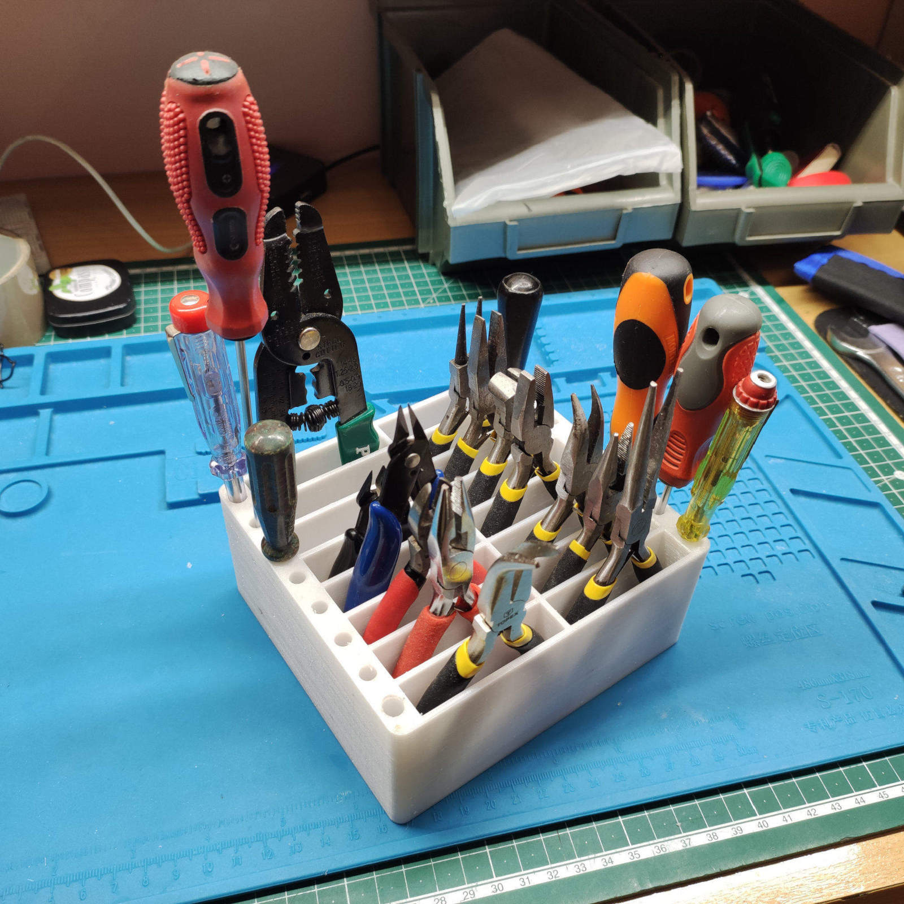

# SMD Component Storage

## Description

Simple tool organizer.

## How To Use

- Open the [3mf model](3mf/toolbox.3mf) in your favorite slicer.
- Prepare model for printing.
- Slice and print.

## How To Get Custom Sized Toolbox

- Open [source 3D model](src/toolbox.f3d) in Fusion 360.
- Open "Parameters" dialog and set variables in "User Parameters" for your needs.
- Export STL models.
- Print.

## Built With

- [Autodesk Fusion 360](https://www.autodesk.com/products/fusion-360/overview).

## Contributing

Please read [CONTRIBUTING.md](CONTRIBUTING.md) for details.

## Versioning

I use [SemVer](http://semver.org/) for versioning. For the versions available, see the
[tags on this repository](https://github.com/ashep/toolbox/tags).

## See also

- [Project on Thingiverse](https://www.thingiverse.com/thing:5243234).

## Authors

- [Alexander Shepetko](https://shepetko.com) -- initial work.

## License

This project is licensed under the MIT License. See the [LICENSE.md](LICENSE.md) file for details.
